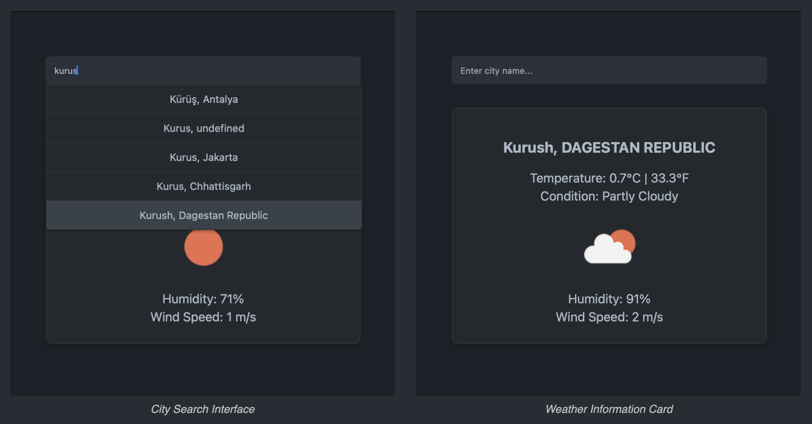

# Weather App

## Overview

Weather App is a user-friendly platform that delivers up-to-date weather information. Utilizing the Open-Meteo API, it
presents localized weather conditions, including temperature, humidity, and wind metrics, complemented by intuitive
icons.

## Key Features

- **City Lookup**: Obtain weather stats for any global city.
- **Comprehensive Reports**: Access details on temperature readings (Celsius/Fahrenheit), humidity levels, wind
  velocities, and condition-specific icons.

## Tech Stack

- **Frontend**: Crafted with HTML and CSS for layout and styling.
- **Functionality**: JavaScript (Async/Await) for responsive API interactions and UI updates.
- **Data Source**: Open-Meteo API for real-time meteorological data.

## Local Setup

To run Weather App locally:

1. Clone the repository:
    ```sh
    git clone https://github.com/eskendarov/weather-forecast-open-meteo.git
    ```
2. Navigate to the cloned directory and open `index.html` in your preferred web browser.

3. Begin by typing a city into the search bar to receive instant weather details.

## Screenshots



## Contribution Guidelines

I appreciate contributions. To contribute:

1. Fork the repository.
2. Create a feature branch (`git checkout -b feature/AmazingFeature`).
3. Commit your changes (`git commit -m 'Add some AmazingFeature'`).
4. Push to the branch (`git push origin feature/AmazingFeature`).
5. Open a pull request.

## Contact

For any inquiries or issues related to the Weather App, please reach out:

- **Email**: [envereskendarov@gmail.com](mailto:envereskendarov@gmail.com)
- **GitHub Issue Tracker**: [Submit Issues](https://github.com/eskendarov/weather-forecast-open-meteo/issues)
- **LinkedIn**: [linkedin.com/eskendarov](http://linkedin.com/in/eskendarov/)

Feel free to contact me for support, to report bugs, or to discuss potential contributions and ideas to improve the app.
